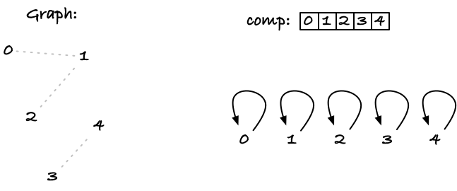

# Connecting grap-nodes, connected components and union-find

This note considers a simple graph where we have `n` nodes, indexed as integers `0, 1, ..., n - 1`, and we have a list of undirected edges `(i,j)` that should be interpreted as there being a connection between node `i` and node `j` and vice versa. The question we consider is an example from *Computational Thinking in Bioinformatics* where we ask whether it is possible to get from one node `A` to another, `B` (framed as cities with roads between them).

There are many ways to solve this problem, but we will only consider two. The one that I had in mind when posing the question that uses connected components of a graph and another solution that came up in class, where we explore all the roads out of `A` to see if we can get to `B`. According to Matthew 20:16, the first shall be the last, so we consider the second solution first.

## Exploring all cities we can reach from `A`

With this approach, we want to explore all roads leading out of `A` exhaustively. To do this, we will first have to order our edges in a way such that we can easily get the immediate neighbours of any node, but luckily this is easy if we make a list of sets for them.

We can construct a list of length `n` consisting of empty sets and then run through the edges `(v,w)` adding `w` as `v`’s neighbour and `v` as `w`’s neighbour.

```python
def build_neighbours(n, edges):
    """Collect sets of neighbours for each node."""
    neighbours = [set() for _ in range(n)]
    for v, w in edges:
        neighbours[v].add(w)
        neighbours[w].add(v)
    return neighbours
```

If we had the simple graph below,


running this function should give us:

```python
>>> build_neighbours(5, [(0, 1), (2, 1), (3, 4)])
[{1}, {0, 2}, {1}, {4}, {3}]
```

You can generate all roads leading out of city `A`, but it involves keeping track of the current path, which neighbours we have explored and which we haven’t, and backtracking when we reach a dead end, so I will not do that. I will do something more straightforward and just explore all cities we can reach without worrying about whether I see them in any order that matches a road trip. If we do it that way, we only need to keep track of which cities we have seen and which we have processed.

```python
def reachable(a: int, neighbors: list[set[int]]) -> set[int]:
    """Collect all cities reachable from `a`."""
    seen, unprocessed = {a}, {a}
    while unprocessed:
        v = unprocessed.pop()  # process the next city
        for w in neighbors[v]:
            if w not in seen:
                seen.add(w)
                unprocessed.add(w)
    return seen
```

Let's take the function for a spin. Consider the graph below, and imagine that we start the exploration from node `1`. I won't write the sets on the figure, but mark nodes in `seen` with an `s` and nodes in `unprocessed` with a `u`. Initially, we have `1` in both sets.


The only node we can take out of `unprocessed` is `1`, so we do that, remove it from `unprocessed` (but not `seen`) and add its neighbours to both sets.


The `pop()` method on sets picks an arbirary element, so we don't really know which one it will be, but let us imagine that it is `2`. That means that `2` is removed from `unexplored` but that its neighbour, `4`, is added to both sets.


Let's say that `0` is now picked from `unprocessed`. This won't add any new neighbours, of course—`1` is its only neighbour, and we already have that in `seen`—so nothing much happens.


The next node to be popped from `unprocessed` has to be `4` (it is the only one there), which will add `3` and `5`.


I will stop here as I am confident that you can finish the example on your own.

Notice how we have a growing set of `seen` nodes as we move `unprocessed` as a form of border of this set, expanding through the graph. When `unprocessed` is eventually empty, we have seen everything we can reach from the initial node, and we return that.

Of course, if you already know that you are searching for a specific node, you can terminate early; if you see it in the exploration, you know you can reach it.

## Building connected components

A connected component in a graph is a maximal set of nodes that can all reach each other. Maximal, here, means that there are no nodes outside the set that can reach all the nodes inside it.

If we run the function we wrote above, we get a set of all the nodes we can reach from a given one, and since you can travel in both directions along all the edges in this note, all nodes in this set can reach each other—it is a connected component.

We can solve the problem of determining if `A` can reach `B` by asking if `A` and `B` are in the same component. That is essentially what we did above. There, we built `A`’s component by exhaustively traversing the graph, but below I will show you a different method of doing the same thing and in a way such that we get *all* the connected components at the same time.

We will use a trick called [*union-find* or *disjoint set*](https://en.wikipedia.org/wiki/Disjoint-set_data_structure), but the basic idea is not as fancy as that sounds.

But before we get clever, we will implement the idea in a simpler and slower way.

### Simple component structure

We need a way to represent components, and for that, we can use something as simple as a list. Let’s call it `comp`. We will loop through all the edges, and the invariant we will have the following invariant:

**Invariant:** For each node `v`, we use `comp[v]` as a representative for `v`’s node, according to the edges we have seen so far.

What we mean by “representative” is anything that uniquely identifies the component, in the sense that `comp[v] == comp[w]` if and only if `v` and `w` are in the same component.

For our first attempt, we will initialise `comp` as `comp[v] = v`; that is, for each node `v`, `comp[v]` contains the node itself. This is clearly a unique representative since no two components are the same, and it represents the components before we have seen any edge at all since, with no edges, each node is its own component.

In the figure below, I have shown a graph on the left. There are three edges, but I have drawn them in dotted grey to indicate that we haven't processed them yet.



On the top right is the `comp` array, initialised to `comp[v] = v`. Below I have a slightly different representation, where each node points to its component representative (i.e. itself).

Now what we will do is loop through all edges `(v, w)`. When we process `(v, w)`, we need to join `comp[v]` and `comp[w]`. We can pick one or the other representative as the new representative, it doesn't matter which. Without loss of generality, let's say we choose to move all elements in `w`'s component to component `comp[v]`. This means that for all nodes `u` with `comp[u] == comp[w]` (all nodes in the same component as `w`) we must change the component to `comp[u] = comp[v]`.

A simple way to handle that is to run through the components and update all nodes with component `comp[w]` like this:

```python
def union(comp: list[int], v: int, w: int) -> None:
    """Merge v's and w's components and update comp accordingly."""
    cv, cw = comp[v], comp[w]
    for u, cu in enumerate(comp):
        if cu == cw:
            comp[u] = cv
```

It isn't super efficient, since we have to look at the components for all nodes each time we join two components, but it gets the job done.[^1]

[^1]: You can of course return before the loop if `cv == cw`, and that would be a good optimisation, but it doesn't change the worst case running time, so to keep the code simple I have left that out.

For our example from above, let's say that the first edge we process is `(2,1)`. We are in the initial state where `comp[2] == 2` and `comp[1] == 1` and we need to merge the two components by setting all nodes that point to `1` to point to `2` instead. In the figure below, I have shown the new value on the right, above the `comp` list and as a new edge.


After the update, nodes `2` and `1` will be in the same component, represented by `comp[v] == 2`.

If we add edge `(0,1)` we should move all nodes `v` with `comp[v] == comp[1] == 2` (those are nodes `1` and `2`) to component `comp[0] == 0`.


If we then add edge `(3,4)`, we should move nodes with component `comp[v] == comp[4] == 4` to component `comp[3] == 3`:


If we continue doing this for each edge, we will eventually have merged all components that have an edge between them, and the invariant guarantees that we have the right solution.

```python
def components(n, edges):
    """
    Compute connected components.

    Compute the connected components for n nodes based on the
    edges. All the nodes listed in the edges must be values in
    the range 0 <= ... < n.
    """
    components = list(range(n))
    for v, w in edges:
        assert 0 <= v < n and 0 <= w < n
        union(components, v, w)
    return components
```

The running time is not impressive. We need to process each edge; let’s say that there are `e` of those, and for each edge, we have to run through the components; there are `n` of those, so we end up with `O(en)`. In a number of steps, though, we can improve on this.

### Components as forests

The first step we take won't get us to a better running time, but it gives us a new way of representing components that we can exploit in better methods.

The key idea will be that `comp[v]` doesn't have to point to a representative for `v`'s component. Instead, we can represent components as a forest of trees, where the forest has a node for each of our graph's node, and where nodes connected in the same tree are interpreted as being part of the same component.

If this doesn't make much sense yet, then read on and hopefully it will soon.

We will use `comp` to represent a forest. This is not a normal forest but a computer science forest, and it means that each node has zero or more "parents" (and really nothing more, in this setting). For node `v`, `comp[v]` will point to `v`'s parent, or it will be `-1` if `v` is doesn't have a parent (and thus is a root).

Initially, we will have all the nodes be their own components, which in this framework means that they are trees consisting only of themselves. Since the nodes are not connected to anything else, each will also be a root.


When we wish to join two components, we have to merge two trees. We do this by making the root of one of the trees the parent of the root of the other. Doing this will change the root of all of the children in the component we merge into the other.

To get the root of any node's tree, we can run up the sequence of parents (represented in the `comp` list, that I will call `f` in the code to reflect that it represents forests):

```python
def is_root(f: list[int], v: int) -> bool:
    """Return True if v is a root."""
    return f[v] == -1


def root(f: list[int], v: int) -> int:
    """Locate the root of v's tree."""
    while not is_root(f, v):
        v = f[v]
    return v
```

Merging two components then looks like this:

```python
def union(f: list[int], v: int, w: int) -> None:
    """Merge v's and w's components and update comp accordingly."""
    f[root(f, v)] = root(f, w)
```

Surprisingly simple, don't you think?

Let's get back to the example and handle the first edge, the one from `2` to `1`. Before we merge the components, `1` and `2` are both roots of their own tree, so `root(1) == 1` and `root(2) == 1`. We will merge the second tree into the first, so we want to set the root of `1` to `2`:


If the next edge is `(0,1)` we want to merge the trees containing `0` and `1`. The first is just a singleton with root `root(0) == 0`, but the second is the tree containing both `1` and `2`, with `2` as the root. We want to merge the second tree into the first, so we need to change the root of `2` to point to `0`:


For the main algorithm, all that changes is the initial value for `comp`. It should no longer be the numbers `[0, 1, 2, ..., n - 1]` but all `-1` to indicate that all the components are their own root.

```python
def components(n, edges):
    """
    Compute connected components.

    Computes the connected components for n nodes based on the
    edges. All the nodes listed in the edges must be values in
    the range 0 <= ... < n.
    """
    components = [-1] * n
    for v, w in edges:
        assert 0 <= v < n and 0 <= w < n
        union(components, v, w)
    return components
```

As I wrote at the start of this section, we don't improve the running time by this. It is possible to have long skinny trees such that `root(v)` has to run through `O(n)` nodes, and that means each `union()` will take linear time, so we end up with an `O(n²)` algorithm. (Ok, it is better than `O(en)` since that can be in `O(n³)`, but it still isn't great).

To improve on this, we need to avoid tall trees. We want short and fat trees instead, where there is never too far from any node to its root. What we want to do, is to balance the trees as we build them.

### Balancing trees

I won't show it here because we see similar proofs many places later in CTiB, but I will claim that if you always make sure to merge the smallest tree into the largest and not the other way around, then the depth of the constructed trees will be logarithmic. That means each search for a root will run in `O(log n)`, and the total running time becomes `O(n log n)`.

All we have to do is keep track of the size of the trees. We could use a separate list for that: `size`. It would initially have `size[v] == 1` for all the singleton trees. Whenever we merge two trees of size `size[v]` and `size[w]`, we merge the smaller into the larger^[2], and the new tree will have size `size[v] + size[w]`.


[^2]: It doesn't matter if we keep track of the height or total size of trees; you can do either, and it still works.

It turns out, though, that we don't need a separate list. We only need to know the size of nodes that are roots (which is good since updating `size` for all nodes takes too long), and roots don't need a value for their parent (they don't have one), so we can make `comp[v]` the size of the tree if `v` is a root, and make it the parent of `v` if it is not.

We need to be able to distinguish between roots and non-roots, though, but we have both positive and negative numbers, so we can make sizes negative (you cannot have size zero anyway), and deal with it that way.

```python
def is_size(v: int) -> bool:
    """Check if v is size."""
    return v < 0


def is_node(v: int) -> bool:
    """Check if v is a node."""
    return v >= 0


def size(v: int) -> int:
    """Cast sizes to integers."""
    assert is_size(v)
    return -v


def to_size(v: int) -> int:
    """Cast integers to sizes."""
    return -v
```

To get the root of a tree, search up as long as the parent is a node. If the parent is a size (i.e. negative), then we are at the root.

```python
def root(f: list[int], v: int) -> int:
    """Locate the root of v's tree."""
    parent = f[v]
    while is_node(parent):
        v, parent = parent, f[parent]
    return v
```

When you merge two components, find their roots, check their sizes, and merge the smaller tree into the larger:

```python
def union(f: list[int], v: int, w: int) -> None:
    """Merge v's and w's components and update comp accordingly."""
    root_v, root_w = root(f, v), root(f, w)
    size_w, size_v = size(f[root_w]), size(f[root_v])
    new_size = to_size(size_w + size_v)

    # make the larger tree the root
    if size_w < size_v:
        root_v, root_w = root_w, root_v
    f[root_v] = root_w
    f[root_w] = new_size
```

**FIXME: example**

### Path contraction

```python
def root(f: list[int], v: int) -> int:
    """Locate the root of v's tree."""
    # Locate the root by running up the path
    root, parent = v, f[v]
    while is_node(parent):
        root, parent = parent, f[parent]

    # Then contract the path to point to the root
    while v != root:
        v, f[v] = f[v], root

    return root
```
